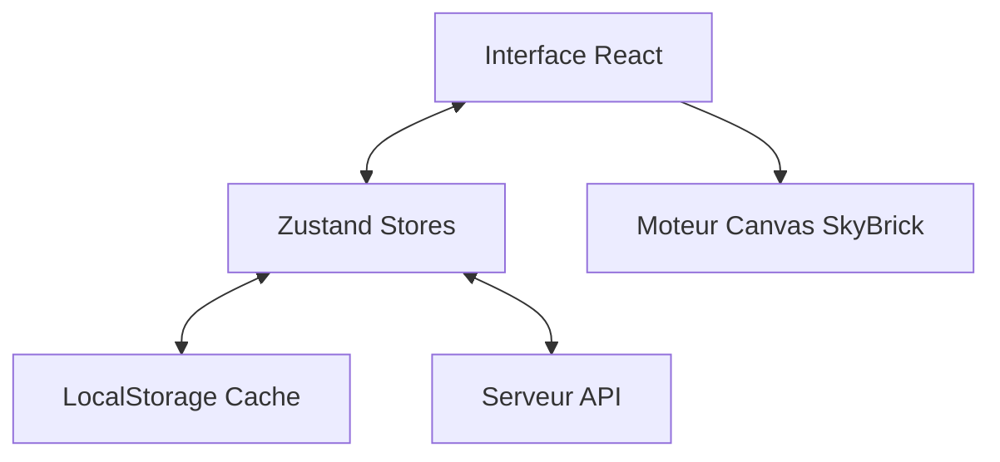

# Documentation Technique - SkyBrick Breakout

Cette documentation détaille l'architecture, la logique et les systèmes qui composent l'application SkyBrick Breakout.

---

## 🚀 Technologies Utilisées

### Frontend
- **React + Vite** : Framework principal pour l'interface utilisateur.
- **HTML5 Canvas** : Moteur de rendu haute performance pour le gameplay Breakout (60 FPS).
- **Tailwind CSS** : Système de styling utilitaire pour un design "Cyber-Néon" premium.
- **Framer Motion** : Bibliothèque d'animations pour les menus et les effets de transition.
- **Lucide React** : Collection d'icônes pour l'UI.
- **Zustand** : Gestion d'état globale pour le profil et les statistiques.

### Backend
- **Node.js + Express** : Serveur API.
- **Socket.io** : Communication en temps réel (Prêt pour le multijoueur).
- **PostgreSQL (Supabase)** : Persistance des données (XP, Stats, Amis).

---

## 🏗️ Architecture Globale

L'application sépare la gestion d'interface (React) du moteur de jeu (Canvas API).

---

## 🧠 Gestion d'État

### 1. `gameStore.js`
Gère le profil utilisateur, l'XP, les niveaux et les préférences (audio, vibration).

### 2. État Local (`VersusBreakout.jsx`)
Contrairement à SkyJo, la logique de SkyBrick est encapsulée dans le composant de jeu pour garantir une réactivité maximale (boucle `requestAnimationFrame`).

### 3. Système de Briques Renforcées (Advanced Armor)
Une hiérarchie de résistance a été introduite pour complexifier la progression :
- **Briques d'Acier (Grises)** : Nécessitent **2 impacts**. Présentes sur les lignes frontales.
- **Briques de Titanium (Sombre/Or)** : Nécessitent **3 impacts**. Protègent le fond du mur.
- **Visuel de Dégâts** : Des fissures dynamiques apparaissent sur les briques lorsqu'elles perdent des points de structure.
- **Exceptions** : La **SUPER BALL** pulvérise n'importe quelle brique, quel que soit son blindage.

### 4. Système de Difficulté (Vitesse du Système)
Les joueurs peuvent désormais ajuster la vitesse de jeu via trois profils de fréquences :
- **Novice** : Vitesse initiale lente (4) et accélération modérée (1.01x).
- **Expert** : Le standard SkyBrick (Vitesse 6, accélération 1.03x).
- **Turbo (Overclock)** : Pour les réflexes extrêmes (Vitesse 8, accélération 1.05x, max 15).

---

## 🎮 Cœur de Jeu : SkyBrick Engine

Le moteur repose sur une boucle de rendu performante située dans `VersusBreakout.jsx`.

### Logique de Physique
- **Vitesse Évolutive** : La balle accélère progressivement à chaque rebond sur la raquette.
- **Calcul d'Angles** : L'angle de sortie de la balle dépend de la zone d'impact sur la raquette pour permettre un contrôle stratégique.
- **Screenshake** : Un système de tremblement d'écran dynamique renforce l'impact lors de la destruction des briques.

### Modes de Jeu
1.  **Solo (Contre les briques)** : Système de 3 vies. La balle est "sticky" (collée) sur la raquette à chaque engagement.
2.  **Versus IA** : Duel pour la domination du terrain. L'IA dispose de différents niveaux de réactivité.
3.  **Online (En développement)** : Architecture prête pour la synchronisation des paddles via Socket.io.

### Système de Bonus (Triple Énergie)
- **⚡ SUPER BALL (Ambre)** : Transperce toutes les briques sans rebondir.
- **↔️ WIDE PADDLE (Cyan)** : Extension temporaire de la raquette de 60%.
- **📚 MULTI BALL (Violet)** : Division de chaque balle active en trois.

---

## 📲 PWA & Design System

### Design "Cyber-Néon"
- Emploi massif de `backdrop-filter: blur` et de filtres `drop-shadow` néon.
- Palette de couleurs cohérente : `#00f2ff` (Cyan), `#9d00ff` (Violet), `#f59e0b` (Ambre).

### PWA
- **manifest.json** : Définit l'identité de l'application sur mobile.
- **Service Worker** : Permet le jeu hors-ligne pour les assets statiques.

---

*Documentation mise à jour le 31 Janvier 2026 - Transition vers SkyBrick Engine.*
